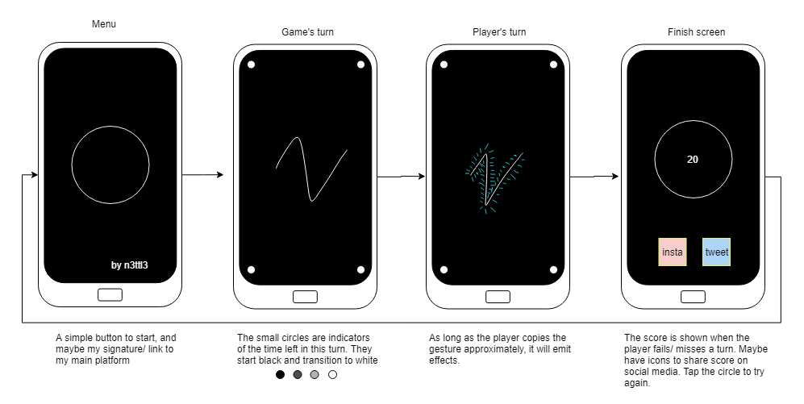
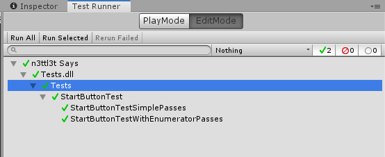
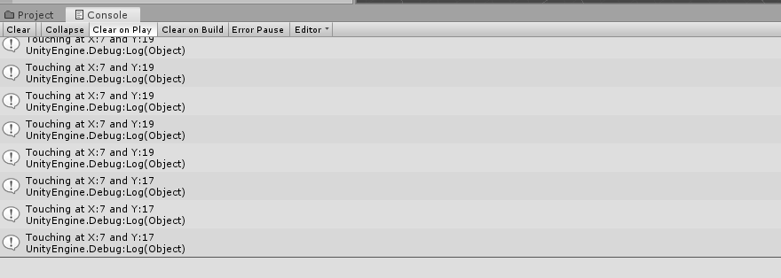
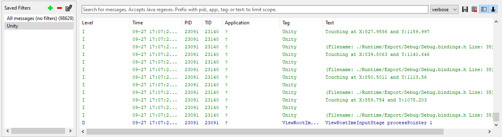
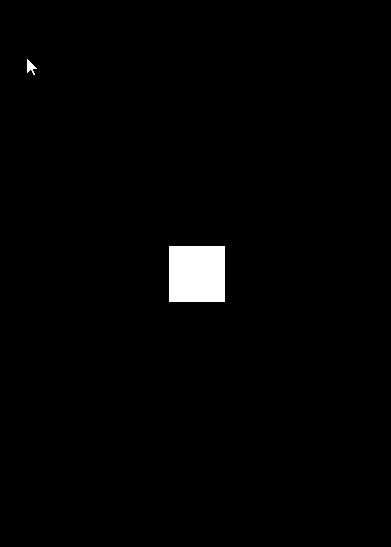
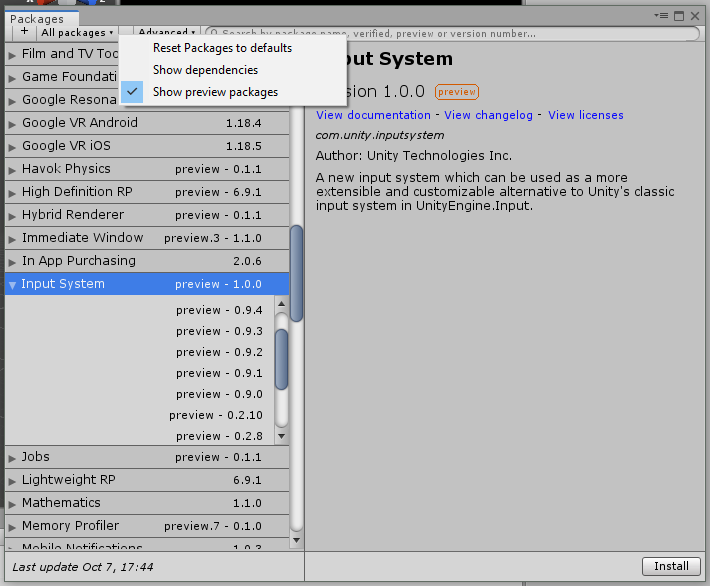
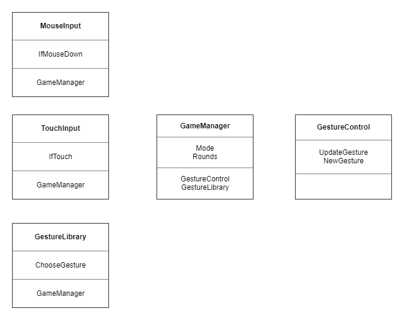
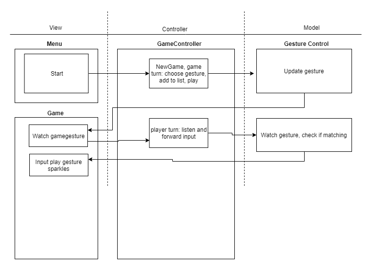
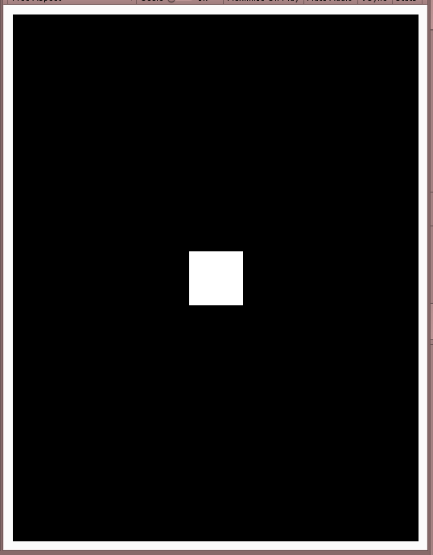
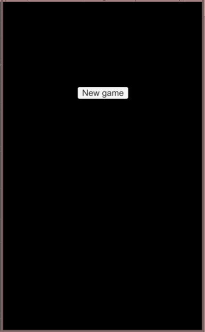

# APPROACH

## Session 001

**Wed Sep 11 15:40:50 - Wed Sep 11 17:22:07**

**To do**
- Plan project
    - Write spec with description, user stories, UX design

**Done**
- Initialised repo with readme and approach
- Made initial mechanics design diagrams
```
The original game was restricted to playing with fixed buttons made of plastic:
```


```
There was no win state, the length of the longest sequence you remembered was your high score.

Taking inspriration from this but with the flexibility of being able to display anything:
```

```
Again the win state will just be a highscore, but with this version the higher your score the more vibrant and dynamic the visual effects could get.
```
- Wrote initial user stories
- Added terminology of main gameplay loops
- Added notes about the future evolution and application of this project

## Session 002

**Thu Sep 12 15:14:15 - Thu Sep 12 16:57:02"

**To do**
- Plan the UX
- Initialise Unity project
- Start on the first user story

**Done**
- Drew the intitial draft of the UX, sans some styling



- Made a new project with a black background

- Test driving the development, delineated the UX loop:
    - Press the start button
    - Watch a gesture
    - Draw a gesture
    - See another gesture if succesful or my score if not
    - Go back to the start menu after seeing my score

- Setting up for testing:
    - Create Assets/Scripts folder
    - Open the Test Runner Window
    - Click create edit mode test runner folder in /Scripts
    - Created StartButtonTest file
    - Checked placeholder tests pass



- Made a .gitignore
- Excluded temp, log, library, builds folders, and all .meta files
- Set Unity package names in player settings
- Ran a test build in Unity
- Unity hanging so forcing quit
- Renamed Unity project folder to remove space
- Build completed

## Session 003

**Fri Sep 27 13:36:43 - Fri Sep 27 14:13:48**

**To do**
- Delineate the first developer story
- Prioritize tasks in a Trello board

**Done**
- Made a [Trello board](https://trello.com/b/6atZPpqj/n3ttl3tsays) with user story 4 intial tasks
- Decided to make it work first in the editor, then in play mode
- Changed my mind about that. Recording in play mode, tools in edit mode.

## Session 004

**Fri Sep 27 15:59:38 - Fri Sep 27 17:08:15**

**To do**
- See if I can console log while running play on my phone
- Test writing the mouse position to file

**Done**
- Ran game on phone
- Ran on phone with visible cube
- Running game just a black screen
- Was in the wrong scene, not in build
- Input Manager in scene that logs mouse position when touching:


- Logging input work on the laptop, doesn't show from the phone
- Tried an adb command:
```
adb logcat -s Unity ActivityManager PackageManager dalvikvm DEBUG

```
- Tried installing modules through unity hub and running the monitor
- Monitor not showing log when touching screen
- Monitor does show now, made a Unity tag filter, added monitor to start menu



- Touch is loggable. Will have to convert mousepos to account for different screen sizes

## Session 005

**Fri Sep 27 17:20:53 - Fri Sep 27 17:57:28**

**To Do**
- Test logging mouse hold position to console
- Move a ball with touch

**Done**
- Logging isn't really a thing to test.
- Touching the screen moves the object but not as expected
- Translating screen to world space



- Noticeable lag on device
    - Changing to FixedUpdate didn't help
    - Need to change to Touches instead of MouseButton

## Session 006

**Mon Oct  7 17:05:40 - Mon Oct  7 18:38:50**

**To do**
- Change out testing story for Houdini instead
- Change mouse pos for touch events

**Done**
- Changed the user story. Trying to test it is just getting in the way. I think it would be more relevent if this was a team project.
- Logged the Input.touchCount to check the device registers touches properly
- Movement changed to touch input but still lagging
    - Reading online, apparently this is a common issue due to engine framerate. Installing a preview package to see if this fixes it since low latency is mission critical.

    
    - Changed the player settings to only use the new input system
    - Added the UnityEngine.InputSystem namespace
    - After reading around, I may have to do this through a new component instead of in a script.


## Session 007

**Sun Oct 13 17:29:44 - Sun Oct 13 18:40:30**

**To do**
- Use the new input system to trigger a script method

**Done**
- Created a controls actions asset
- In the inspector for the asset, click create c# file
- Create a playergesturingscript that has a private Controls assigned in awake
- Add the assembly reference:
    ```
    using UnityEngine.InputSystem;
    ```
- Add on enable and disable events that add/remove callbacks to the action and enable them
- Tested the input on the device logs the message, it does

## Session 008

**Sun Oct 13 19:40:51 - Sun Oct 13 21:22:00**

**To do**
- Get the position of the touch
- Move the cube with the touch

**Done**
- Added a new action to the input controller
- Set it to be a value, the touch position
- Read the value
- Use the value to change position of cube
- Still lags
- Found a paid plugin on the asset store that can decrease the latency slightly
- Using android debug tools, found that there is a lag natively on android, not just from unity.
- Could be a mission critical limitation, no way to know without testing the mvp
- Found another thread that used normalised values to cut latency
- Not really sure what normalize does but didn't help

## Session 009

**Mon Oct 21 18:42:25 - Mon Oct 21 19:17:45**

**To do**
- Roll back to simple touch input
- Implement simple click input
- Make touches and clicks trigger separate behaviour script (single responsibility principle)
- Plan the implementation of turns and rounds

**Done**
- Went back to simple touch input
- Simple mouse input
- touches and clicks trigger GestureControl component

## Session 010

**Mon Oct 21 19:50:44 - Mon Oct 21 20:36:02**

**To do**
- Plan the implementation of turns and rounds
- Make some gestures in the animator. Get the game loop working before planning the recorder implementation


**Done**
- Removed the old input package
- Started the CRC diagram:

    

- Started the control flow diagram but got a bit stuck:

    

- Roughed out the game loop algorithm
    - 1. Player presses play
            - Tap the play button
            - Enter game mode scene
    - 2. Watch a gesture
            - Start the visual metronome border
            - Make a list of gestures
            - Choose one from library and add it
            - Play the next gesture on the list
    - 3. Try and copy the gesture
            - Restart the visual metronome border
            - Play the gesture invisibly
            - If the touch collides with the gesture, increase the turn score
    - 4. If close, emit sparkles
            - When turn score increases, emit particles
    - 5. If enough sparkles, next round (repeat from 2 with a new gesture added)
            - Wait for the metronome to finish
            - If turn score > difficulty out of a hundred, back to 2
    - 6. If not enough sparkles, game ends
            - If turn score < difficulty out of a hundred, go to 7
    - 7. Display the score
            - Keep score across to game ended screen

## Session 011

**Mon Oct 21 20:43:55 - Mon Oct 21 21:13:43**

**To do**
- Make menu, main and end scenes
- Make buttons to move between them
- Make a visual metronome that just plays twice for now

**Done**
- Made a menu scene and removed input and gesture control scripts
- Added a canvas and button to the input manager
- made a menu script with a playnewgame method
- Created a new canvas gameobject instead, added the menu script to that
- Changed the method to accept a string for the level to make it reuseable
- Copied the scene and changed button text and level to load string, to make it the end menu
- Made a GameManager script on a new empty object
- Made a new canvas object called metronome and started adding borders

## Session 012

**Mon Oct 21 21:18:59 - Mon Oct 21 22:05:11**

**To Do**
- Make the border
- Animate the border
- Add game over logic

**Done**
- Added border panels and anchored them to each side
- Made the canvas size renderer a constant pixel size
- Made an animation folder with a controller for the new metronome animator component
- Added a new animation in the controller with the borders colours as parameters
- Faded the colour from white to black

    

-  Made a metronome script with a finishTurn method
- Added a switch so the metronome flips the current turn on the gamemanager between game and player
- Added an event to the animator the trigger the switch
- Added a method to check the turn score if it is the player turn
    - difficulty value is a range slider from 0 to 100
    - Loads end menu if < difficulty
    - Happens late...
- Changed the canvas's to have constant physical size instead of by pixels (looked to small on device)
- Adjusted dimensions of buttons and borders

## Session 013

**Fri Oct 25 13:46:40 - Fri Oct 25 14:57:12**

**To do**
- Remove latency on metronome check(only trigger fade animation if passed?)
- Make sample animations as example gestures

**Done**
- Added a trigger condition to the metronome's animator loop
- Found the animator with getcomponent
- Set play trigger unless player fail
- Made a gesture library folder
- Made a GestureLibraryInput script that will read from the library and send a vector to the gesture control
- Gave the input manager an animator
- Made an empty to animate
- Made a sample animation to trigger
- Trigger the anim on game's turn
- Coroutine starts and stops sending the animtarget vector to gesture control
- Moved the worldpoint logic to only the relevant inputs
- Disable touch and mouse inputs from game manager during game's turn
- Made gamemanager trigger game's turn first

## Session 014

**Fri Oct 25 16:26:50 - Fri Oct 25 17:36:44**

**To do**
- Increase length of metronome and gestures
- Play animations in the background of player's turn for comparison
- Use collisions to detect tracing
- Collisions add up to reach win condition

**Done**
- Increased turn length (manually, needs to be centralised)
- Triggered the gesture to play but not send a vector
- Gave the animatarget a collider
- Renamed the animtarget to gesturetarget and gave it a script
- Increase int(score) on gesturetarget during collisions
- Add an event at the start of the metronome
- Split logic between the events
- Difficulty needs to be dynamic, based on frame count
    - Measure it at the start of a player turn
    - Measure it at the finish of a player turn
    - Minus the start from the finish
    - Difficulty = that minus 10% of it
    - Made it 20% offset instead
    - After playing on device, made it 40%
- Losing:



- Winning:


## Session 015

**Fri Oct 25 18:03:20 - Fri Oct 25 18:39:56**

**To do**
- Change the cube to a sphere
- deactivate target sphere mesh during game's turn
- make more gesture sample animations

**Done**
- Cube to sphere
- Set mesh renderer as a public variable, enabled and disabled it
- Made three more sample gestures

## Session 016

**Wed Oct 30 15:46:20 - Wed Oct 30 17:02:55**

**To do**
- choose from gestures randomly
    - make a list of gestures from folder
    - directly assign it
- add gestures to an list to iterate through each round


**Done**
- Tried getting all the gestures with AssetDatabase.LoadAllAssetsAtPath,didn't work
- Resources folder is standard practice, switching to Resources.LoadAll("Gestures", typeof(Animation)), still doesn't work
- Found can't add them manually either
- Was declaring them as Animations, should have been AnimationClips
- Trying to use animator overrides but not changing anything
    - The actual clip name, not the state node, needs to be provided for override
---

## Tasks

- Make editor view closer to device scaling
- Add an automatic switch for input (editor/device)