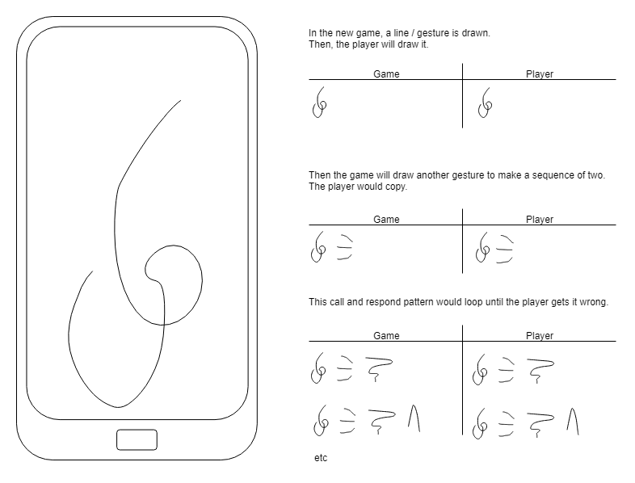

# APPROACH

## Session 001

**Wed Sep 11 15:40:50 - Wed Sep 11 17:22:07**

**To do**
- Plan project
    - Write spec with description, user stories, UX design

**Done**
- Initialised repo with readme and approach
- Made initial mechanics design diagrams
```
The original game was restricted to playing with fixed buttons made of plastic:
```


```
There was no win state, the length of the longest sequence you remembered was your high score.

Taking inspriration from this but with the flexibility of being able to display anything:
```

```
Again the win state will just be a highscore, but with this version the higher your score the more vibrant and dynamic the visual effects could get.
```
- Wrote initial user stories
- Added terminology of main gameplay loops
- Added notes about the future evolution and application of this project

## Session 002

**Thu Sep 12 15:14:15 - Thu Sep 12 16:57:02"

**To do**
- Plan the UX
- Initialise Unity project
- Start on the first user story

**Done**
- Drew the intitial draft of the UX, sans some styling


- Made a new project with a black background

- Test driving the development, delineated the UX loop:
    - Press the start button
    - Watch a gesture
    - Draw a gesture
    - See another gesture if succesful or my score if not
    - Go back to the start menu after seeing my score

- Setting up for testing:
    - Create Assets/Scripts folder
    - Open the Test Runner Window
    - Click create edit mode test runner folder in /Scripts
    - Created StartButtonTest file
    - Checked placeholder tests pass


- Made a .gitignore
- Excluded temp, log, library, builds folders, and all .meta files
- Set Unity package names in player settings
- Ran a test build in Unity
- Unity hanging so forcing quit
- Renamed Unity project folder to remove space
- Build completed

## Session 003

**Fri Sep 27 13:36:43 - Fri Sep 27 14:13:48**

**To do**
- Delineate the first developer story
- Prioritize tasks in a Trello board

**Done**
- Made a [Trello board](https://trello.com/b/6atZPpqj/n3ttl3tsays) with user story 4 intial tasks
- Decided to make it work first in the editor, then in play mode
- Changed my mind about that. Recording in play mode, tools in edit mode.

## Session 004

**Fri Sep 27 15:59:38 - Fri Sep 27 17:08:15**

**To do**
- See if I can console log while running play on my phone
- Test writing the mouse position to file

**Done**
- Ran game on phone
- Ran on phone with visible cube
- Running game just a black screen
- Was in the wrong scene, not in build
- Input Manager in scene that logs mouse position when touching:


- Logging input work on the laptop, doesn't show from the phone
- Tried an adb command:
```
adb logcat -s Unity ActivityManager PackageManager dalvikvm DEBUG

```
- Tried installing modules through unity hub and running the monitor
- Monitor not showing log when touching screen
- Monitor does show now, made a Unity tag filter, added monitor to start menu


- Touch is loggable. Will have to convert mousepos to account for different screen sizes

## Session 005

**Fri Sep 27 17:20:53 - Fri Sep 27 17:57:28**

**To Do**
- Test logging mouse hold position to console
- Move a ball with touch

**Done**
- Logging isn't really a thing to test.
- Touching the screen moves the object but not as expected
- Translating screen to world space


- Noticeable lag on device
    - Changing to FixedUpdate didn't help
    - Need to change to Touches instead of MouseButton

## Session 006

**Mon Oct  7 17:05:40 - Mon Oct  7 18:38:50**

**To do**
- Change out testing story for Houdini instead
- Change mouse pos for touch events

**Done**
- Changed the user story. Trying to test it is just getting in the way. I think it would be more relevent if this was a team project.
- Logged the Input.touchCount to check the device registers touches properly
- Movement changed to touch input but still lagging
    - Reading online, apparently this is a common issue due to engine framerate. Installing a preview package to see if this fixes it since low latency is mission critical.

    
    - Changed the player settings to only use the new input system
    - Added the UnityEngine.InputSystem namespace
    - After reading around, I may have to do this through a new component instead of in a script.


## Session 007

**Sun Oct 13 17:29:44 - Sun Oct 13 18:40:30**

**To do**
- Use the new input system to trigger a script method

**Done**
- Created a controls actions asset
- In the inspector for the asset, click create c# file
- Create a playergesturingscript that has a private Controls assigned in awake
- Add the assembly reference:
    ```
    using UnityEngine.InputSystem;
    ```
- Add on enable and disable events that add/remove callbacks to the action and enable them
- Tested the input on the device logs the message, it does

## Session 008

**Sun Oct 13 19:40:51 - Sun Oct 13 21:22:00**

**To do**
- Get the position of the touch
- Move the cube with the touch

**Done**
- Added a new action to the input controller
- Set it to be a value, the touch position
- Read the value
- Use the value to change position of cube
- Still lags
- Found a paid plugin on the asset store that can decrease the latency slightly
- Using android debug tools, found that there is a lag natively on android, not just from unity.
- Could be a mission critical limitation, no way to know without testing the mvp
- Found another thread that used normalised values to cut latency
- Not really sure what normalize does but didn't help

## Session 009

**Mon Oct 21 18:42:25 - Mon Oct 21 19:17:45**

**To do**
- Roll back to simple touch input
- Implement simple click input
- Make touches and clicks trigger separate behaviour script (single responsibility principle)
- Plan the implementation of turns and rounds

**Done**
- Went back to simple touch input
- Simple mouse input
- touches and clicks trigger GestureControl component

---

## Tasks

- Metronome border
- Add a switch for input (editor/device)