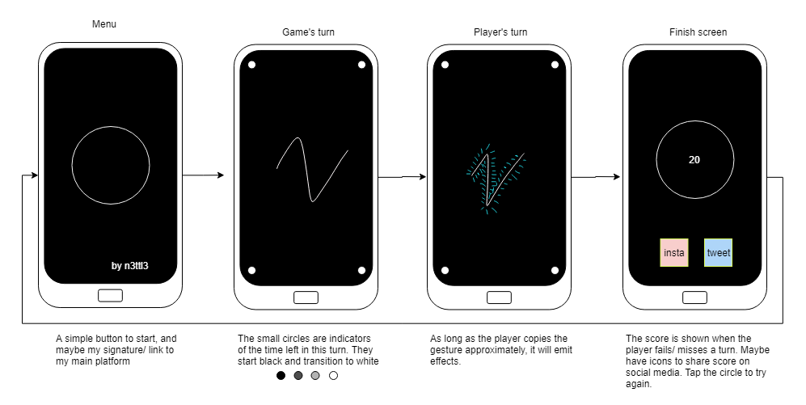
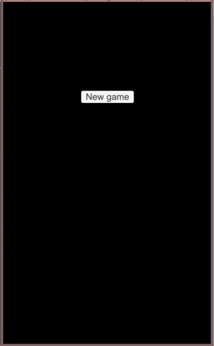

#


## A pattern memory game

The classic handheld flashing lights reimagined for touch screens.
Initially a minimalist game but really the base mechanic to be repurposed for a series of interactive poems.

Please see the [approach](APPROACH.md) for details of my development process.

## Gameplay

The original game was restricted to playing with fixed buttons made of plastic:


There was no win state, the length of the longest sequence you remembered was your high score.

Taking inspriration from this but with the flexibility of being able to display anything:


Again the win state will just be a highscore, but with this version the higher your score the more vibrant and dynamic the visual effects could get.

## User Stories

```
As a player,
so I can exercise my memory,
I want to be presented with growing sequences of gestures for me to copy
```

```
As a player,
so I can have feedback when I'm doing well,
I want my gestures to trigger drawing effects and sounds
```

```
As a player,
so I can challenge myself,
I want to be able to see my highscore
```

```
As the developer,
so I can design gestures easily,
I want a way to record my own and compare input to them
```


## Spec

### Terminology:
- A beat: one run of the metronome, one gesture
- A turn: one run through of a sequence of gestures, either the game's or the player's.
- A round: two turns, the game's and the player's.
- A sequence: a collection of turns. The length of this collection is the score.

## UX



## Particle types

**Type 1**


**Type 2**


**Type 3**


**Type 4**
(The scaling of type 4 looks better on an android device)


## MVP

- **Losing.** In this gif the player cube doesn't follow the gesture accurately enough and the game ends:



- **Winning.** In the gif the player follows the gesture accurately enough for two turns:


---

## Extension

This is a game on it's own, but also the mechanical basis/ MVP for a series of art pieces as games. How they will differ:
- The sequences will be of a fixed length each.
- The tempo of each sequence will be determined by the art already made.
- The gestures in each round will be designed over the art.
- The gestures will be designed as less or more difficult by their length, ergonomics(placement, divisions and directions) and speed.
- Difficulty will also be determined by how precise the player's position and timing of there gestures must be.
- The player's turns will animate the audiovisual elements of the interactive poem, if played correctly.
- Rules of a piece: composed of sequences that are straight ahead (one beat, copy it and onto the next or fail and loop), or accumulative (like the base game). Can have checkpoints, the ends of completed sequences, so pieces are composed of sequences.
And then much further down the line, as VR pieces:
- 3D gestures
- Haptic feedback and outward-facing camera sharing/integration when moving in sync with other remote networked players
